## Praktikum 1 Probstat

### 1. Seorang penyurvei secara acak memilih orang-orang di jalan sampai dia bertemu dengan seseorang yang menghadiri acara vaksinasi sebelumnya.

\
a) Berapa peluang penyurvei bertemu x = 3 orang yang tidak menghadiri acara vaksinasi sebelum keberhasilan pertama ketika p = 0,20 dari populasi menghadiri acara vaksinasi ?
(distribusi Geometrik)

b) mean Distribusi Geometrik dengan 10000 data random , prob = 0,20 dimana distribusi
geometrik acak tersebut X = 3 ( distribusi geometrik acak () == 3 )

c) Bandingkan Hasil poin a dan b , apa kesimpulan yang bisa didapatkan?

d) Histogram Distribusi Geometrik , Peluang X = 3 gagal Sebelum Sukses Pertama
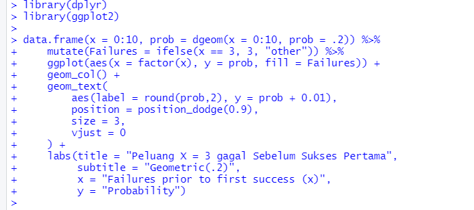

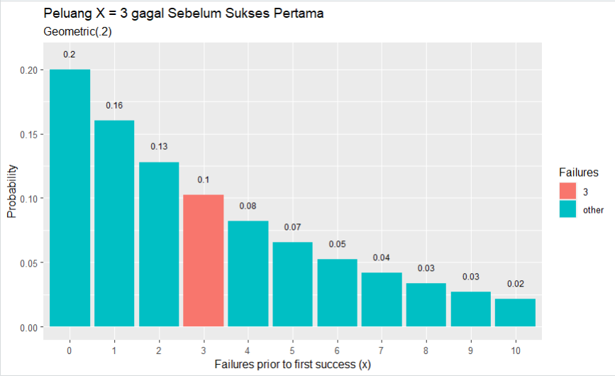

e) Nilai Rataan (μ) dan Varian (σ²) dari Distribusi Geometrik.

> rataan

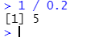

> varian

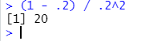

### 2. Terdapat 20 pasien menderita Covid19 dengan peluang sembuh sebesar 0.2. Tentukan :

a. Peluang terdapat 4 pasien yang sembuh.

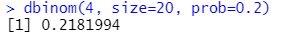

b. Gambarkan grafik histogram berdasarkan kasus tersebut.

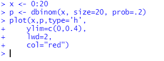

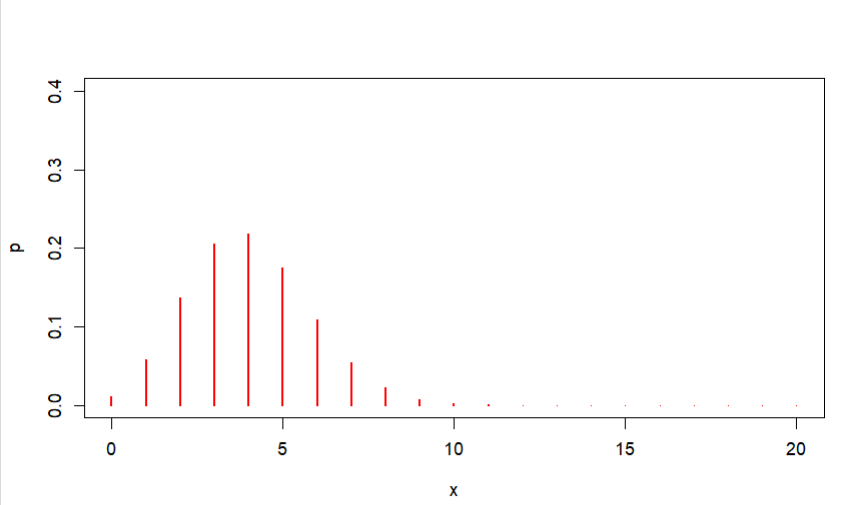

c. Nilai Rataan (μ) dan Varian (σ²) dari Distribusi Binomial

> table untuk menemukan rataan dan varian

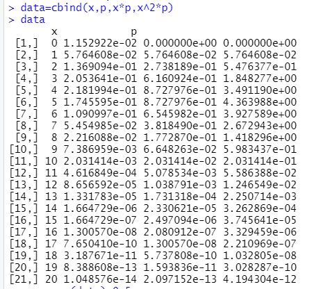

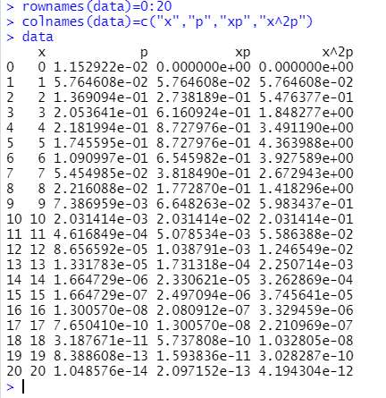

> rataan

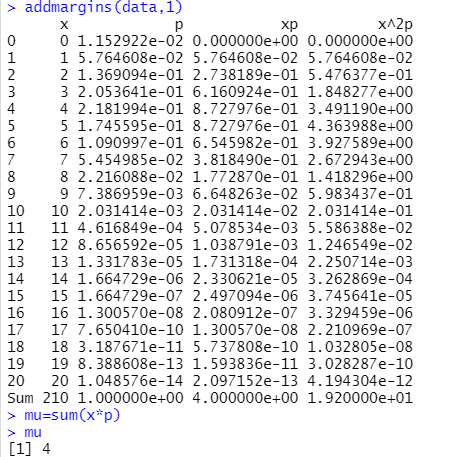

> varian

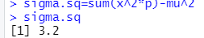

### 3. Diketahui data dari sebuah tempat bersalin di rumah sakit tertentu menunjukkan rata-rata historis 4,5 bayi lahir di rumah sakit ini setiap hari. (gunakan Distribusi Poisson)

a. Berapa peluang bahwa 6 bayi akan lahir di rumah sakit ini besok?

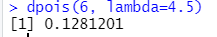

b. simulasikan dan buatlah histogram kelahiran 6 bayi akan lahir di rumah sakit ini selama setahun (n = 365)

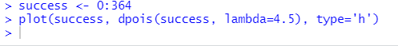

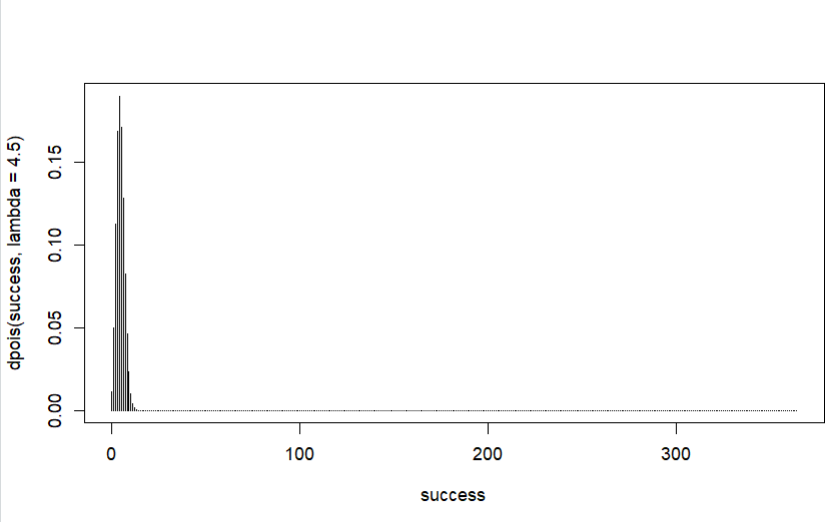

c. dan bandingkan hasil poin a dan b , Apa kesimpulan yang bisa didapatkan

d. Nilai Rataan (μ) dan Varian ( σ² ) dari Distribusi Poisson.

> rataan

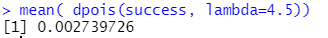

> variance

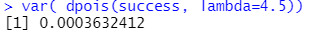

### 4. Diketahui nilai x = 2 dan v = 10. Tentukan:

a. Fungsi Probabilitas dari Distribusi Chi-Square.

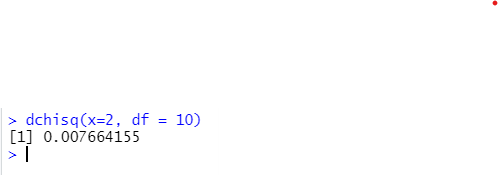

b. Histogram dari Distribusi Chi-Square dengan 100 data random.

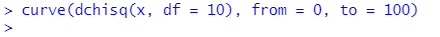

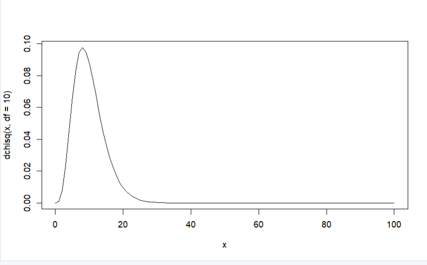

c. Nilai Rataan (μ) dan Varian ( σ² ) dari Distribusi Chi-Square.

> rata

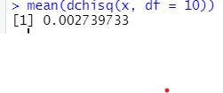

> varian

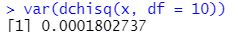

### 5. Diketahui bilangan acak (random variable) berdistribusi exponential (λ = 3). Tentukan

a. Fungsi Probabilitas dari Distribusi Exponensial

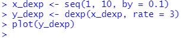

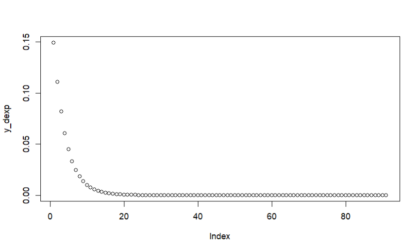

b. Histogram dari Distribusi Exponensial untuk 10, 100, 1000 dan 10000 bilangan random

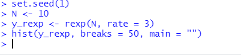

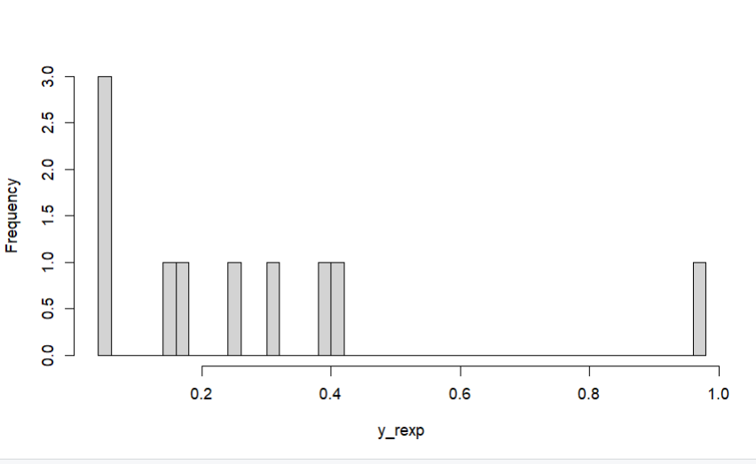

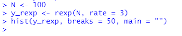

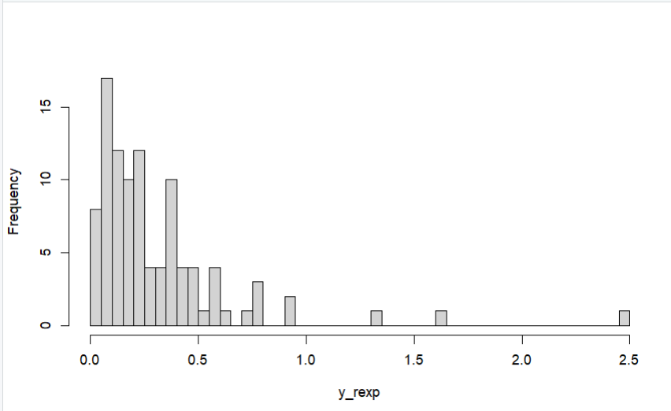

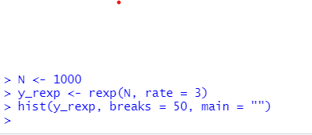

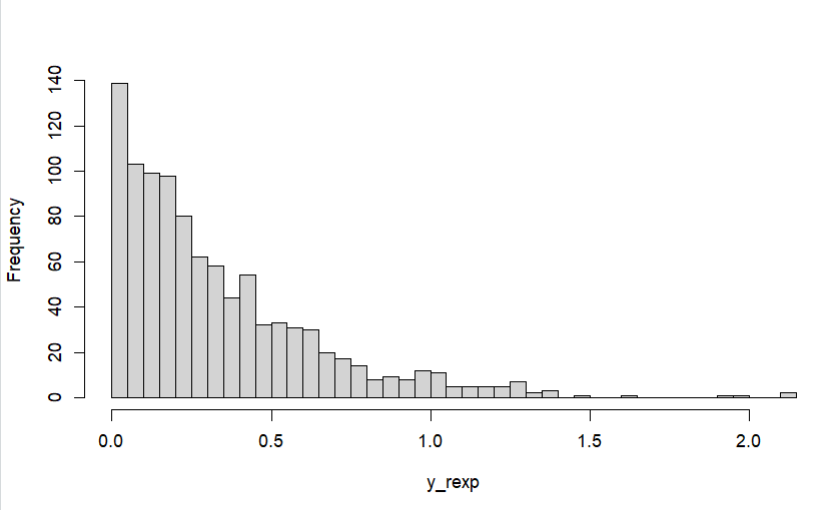

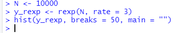

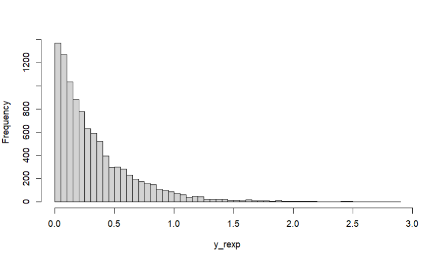

c. Nilai Rataan

> rata

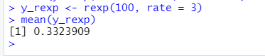

> varian

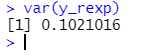

### 6. Diketahui generate random nilai sebanyak 100 data, mean = 50, sd = 8. Tentukan

a. Fungsi Probabilitas dari Distribusi Normal P(X1 ≤ x ≤ X2), hitung Z-Score Nya dan plot
data generate randomnya dalam bentuk grafik. Petunjuk(gunakan fungsi plot()).
Keterangan :
X1 = Dibawah rata-rata
X2 = Diatas rata-rata
Contoh data :
11
1,2,4,2,6,3,10,11,5,3,6,8
rata-rata = 5.083333
X1 = 5
X2 = 6

> di bawah rata-rata

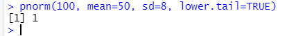

> di atas rata-rata

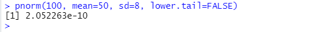

b. Generate Histogram dari Distribusi Normal dengan breaks 50 dan format penamaan:
NRP*Nama_Probstat*{Nama Kelas}\_DNhistogram
Contoh :
312312312_Rola_Probstat_A_DNhistogram

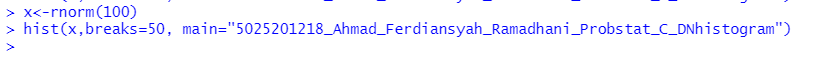

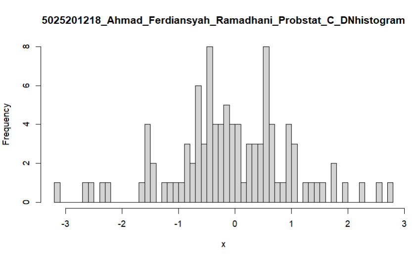

c. Nilai Varian ( ) dari hasil generate random nilai σ² Distribusi Normal.

> varian

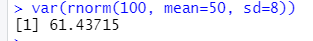
